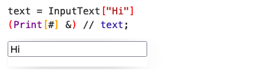
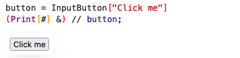
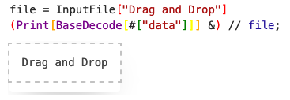

# Standart I/O library for WLJS
*written with love in Javascript*

__This is a core component of [Wolfram JS Frontend](https://github.com/JerryI/wolfram-js-frontend) project__
but one can try to use it independently as well

This library allows a user to use standart HTML inputs like slider, radio, file dragging together with Wolfram Language ecosystem. Each input generates an event object, where a handler can be assigned to (please see [Events.wl](https://github.com/JerryI/wolfram-js-frontend/blob/master/Kernel/Events.wl)). 

## Development
Only possible with installed [Wolfram JS Frontend](https://github.com/JerryI/wolfram-js-frontend)

To build this extension
```bash
npm i
npm run build
```

or for live-update
```shell
npm i
npm run watch
```

## Features
Each type of an input is shipped with two components
- __event generator__ (like `InputButton`, `InputText`)
- __view__ component (like `ButtonView`, `TextView`), which are executed on the frontend

An __event generator__ is just a wrapper of __view component__, that automatically generates an event object and attaches it to the input view. The reason, why they are still separate thing is that __view component__ can act on both sides as an indicator or a display and as an input device. Moreover, it can mutate [FrontEndObjects](https://github.com/JerryI/wolfram-js-frontend) without communicating to Wolfram Kernel.

## Basic usage

### Range input
A basic combo of a slider and numerical input field

```mathematica
range = InputRange[0, 10, 1, "Label"->"Range"]
(Print[#] &) // range;
```


It sends numberical values to the handler function.

### Text input
Text input, that sends as a string to the kernel

```mathematica
text = InputText["Hi"]
(Print[#] &) // text;
```



### Select
🚧 in dev 

### Wolfram Language Input
🚧 in dev

### Radio
🚧 in dev

### Toggle
Acts as a checkbox

```mathematica
toggle = InputToggle[False, "Label"->"Toggle"]
(Print[#] &) // toggle;
```


On switch it sends boolean values to the handler.

### Button

```mathematica
button = InputButton["Click me"]
(Print[#] &) // button;
```



On press it sends `True` to the handler

### File input

Sents any file as a `base64` encoded string via POST method

```mathematica
file = InputFile["Drag and Drop"]
(Print[BaseDecode[#["data"]]//ByteArrayToString] &) // file;
```



Try firstly with some small text files. The structure of the data for each file is following
```mathematica
<|"data"->"base64 encoded byte array", "name"->"filename"|>
```

## Grouping
One can group different inputs into a single event-object, that maintains the original structure

### Associations
```mathematica
group = InputGroup[<|
  "left"->InputRange[0, 10, 1, "Label"->"Range 1"],
  "right"->InputRange[0, 10, 1, "Label"->"Range 2"] 
|>]
(Print[#]&) // group;
```


On each update it generates the data fro the handler function in a form

```mathematica
<|"left"->5, "right"->7|>
```

### Arrays
```mathematica
group = InputGroup[{
  InputRange[0, 10, 1, "Label"->"Range 1"],
  InputRange[0, 10, 1, "Label"->"Range 2"],
  InputText["Hi"]
}]
(Print[#]&) // group;
```


On each update it generates the data fro the handler function in a form

```mathematica
{5, 7, "Hi"}
```

### Columns and rows
🚧 in dev

### Manipulate
🚧 in dev

## Advanced usage (low-level)
In principle one can use __view components__ directly. 

### Range view
This code
```mathematica
range = InputRange[0, 10, 1]
(Print[#] &) // range;
```
at the end transforms into
```mathematica
range = EventObject[<|"id"->CreateUUID[]|>];
RangeView[{0, 10, 1, 5}, "Event"->range[[1]]["id"]] // CreateFrontEndObject
(Print[#]&) // range;
```

However, since this is view component, it can be used in the opposite way like to display a variable

```mathematica
CreateFrontEndObject[7, "variable"]
RangeView[{0, 10, 1, FrontEndExecutable["variable"]}] // FrontEndOnly // CreateFrontEndObject
```

and in the next cell we can change the variable and see the result

```mathematica
FrontEndExecutable["variable"] = RandomInteger[{0, 10}]
```


### Substituting by reference and by variable

The wrapping expression `FrontEndOnly` prevents kernel to substitute the numerical value of `variable` into the view component

```mathematica
FrontEndExecutable["variable"]
```

It connects the variable to the view in a one way. Let us call it substituting __by variable__. 

There is another way to pass `variable` into the component 

```mathematica
FrontEndRef["variable"]
```

For most functions it has the same effect as the previous one, however here connects the variable to the view in two-ways. A view can mutate the variable. Let us call it as __by the reference__. 

Here is an example


In this sence it does not even send anyhting to the kernel, an update cycle happends in the browser. 

### Text view

Here is an example of two fields, where one shows the result and other one is used as an input


While typing in the first field, one can see an inversed string in the second one.


# License

Project is released under the GNU General Public License (GPL).